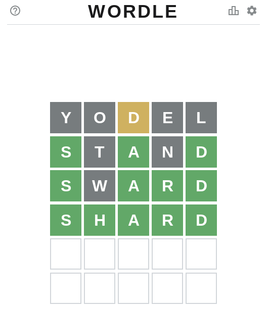

# wordle cheart script

* This is a cheat script for https://www.powerlanguage.co.uk/wordle/ .
* This script depends on 
    * Python3
    * wamerican package (/usr/share/dict/words)
    * and grep command.

## How to use it



* Let's start with "y____". That represents the first character is "y" and rest characters are  wildcard.
* You can also start with other characters like "p____", "m____" and "_____".
* In this case, I tried "yodel".

````
$ ./wordle.py -p y____
yacht
yacks
...
yeses
yield
yocks
yodel
yogin
yogis
...
yummy
yuppy
````

* We found the word includes "d" and excludes "yoel". So let's find these words.
* In this time, I tried "stand".

```
$ ./wordle.py -p _____ -i d -e yoel
Adams
Adana
...
spuds
squad
squid
staid
stand
studs
sward
third
...
width
winds
```

* Oh, we found the word is "s_a_d". And that excludes "yoeltn".
* There are only two words that fit the criteria.
* I tried "sward".

```
$ ./wordle.py -p s_a_d -e yoeltn
shard
sward
```

* Oh, we found the word is "s_ard". And that excludes "yoeltnw".
* There is only one word that fits the criteria.
* The word is "shard".

```
$ ./wordle.py -p s_ard -e yoeltnw
shard
```

## Prepare

* This cheat program uses "/usr/share/dict/words".
* You can install the dictionary by the apt command for the Debian/Ubuntu. 
```
$ sudo apt install wamerican
```
